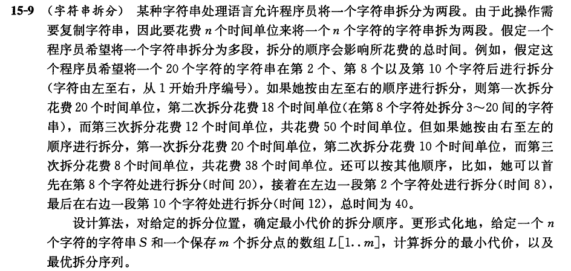

# 字符串拆分

某种字符串处理语言允许程序员将一个字符串拆分为两段. 由于此操作需要复制字符串，因此要花费 $n$ 个时间单位来将一个 $n$ 个字符的字符串拆为两段. 假定一个程序员希望将一个字符串拆分为多段，拆分的顺序会影响所花费的总时间. 例如，假定这个程序员希望将一个 $20$ 个字符的字符串在第 $2$ 个、第 $8$ 个以及第 $10$ 个字符后进行拆分（字符由左至右，从 $1$ 开始升序编号）.

- 如果她按由左至右的顺序进行拆分，则第一次拆分花费 $20$ 个时间单位（在第 $2$ 个字符处拆分 $1 \sim 20$ 间的字符串），第二次拆分花费 $18$ 个时间单位（在第 $8$ 个字符处拆分 $3 \sim 20$ 间的字符串），第三次拆分花费 $12$ 个时间单位（在第 $10$ 个字符处拆分 $9 \sim 20$ 间的字符串），共花费 $50$ 个时间单位.
- 如果她按由右至左的顺序进行拆分，第一次拆分花费 $20$ 个时间单位，第二次拆分花费 $10$ 个时间单位，而第三次拆分花费 $8$ 个时间单位，共花费 $38$ 个时间单位.
- 还可以按其他的顺序，比如，它可以首先在第 $8$ 个字符处进行拆分（时间 $20$），接着在左边一段第 $2$ 个字符处进行拆分（时间 $8$），最后在右边一段第 $10$ 个字符处进行拆分（时间 $12$），总时间为 $40$.

设计算法，对给定的拆分位置，确定最小代价的拆分顺序. 更形式化地，给定一个 $n$ 个字符地字符串 $S$ 和一个保存 $m$ 个拆分点的数组 $L[1..m]$，计算拆分的最小代价，以及最优拆分序列.

## 输入格式

输入包含 $2$ 行：
- 第一行包含两个整数 $n$ 和 $m$（$1\leq m < n$），分别表示**字符串 $S$ 的长度**和**拆分点数组 $L$ 的长度**.
- 第二行包含 $m$ 个整数，表示数组 $L$（1 \leq L[1] < \cdots < L[m] < n）.

## 输出格式

输出包含 $2$ 行：
- 第一行只包含 $1$ 个整数，表示拆分的最小代价.
- 第二行包含 $m$ 个整数，表示最优拆分序列.

注：可能存在多个 $L$ 满足题目要求，输出任意其一即可.

// TODO 对于 1 个测试样例而言，最优拆分序列有多个答案，该怎么保证答案的一致性呢？
// TODO 进一步解释名词“最优拆分序列”.

## 样例

### 1

```input
20 3
2 8 10
```

```output
38
3 2 1
```

### 2

```input
30 4
12 15 20 27
```

```output
70
2 1 3 4
```

### 3

```input
5 4
1 2 3 4
```

```output
12
3 2 1 4
```

## 附件


